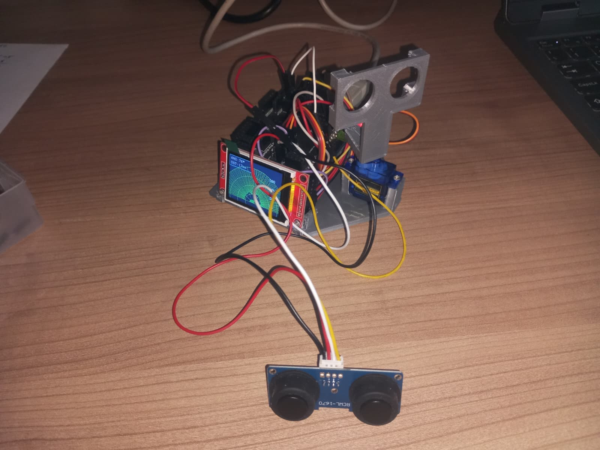
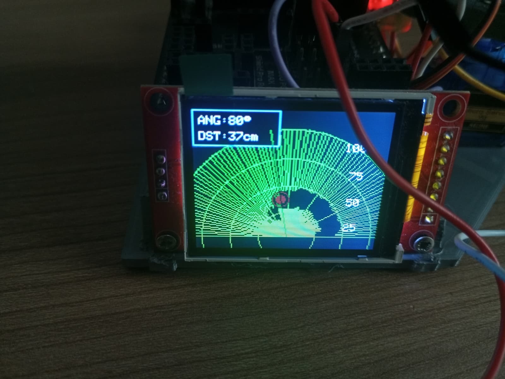

# 180° TFT Radar Scanner



A smooth 180° radar scanner built with:

* Arduino Uno
* HC-SR04
* SG90 Servo Motor
* ST7735 TFT 1.8 Inch Display

This project simulates a real radar interface using a rotating ultrasonic sensor and a TFT display with a custom UI optimized for 180° scanning.

---

# Features

* 180° radar sweep
* Smooth TFT rendering
* Flicker-reduced drawing system
* Real-time object detection
* Radar glow effect
* Distance rings
* Angle markers
* HUD information panel
* Optimized for Arduino UNO performance
* Landscape TFT orientation

---

# UI Preview



---

# Hardware Required

| Component                 | Quantity |
| ------------------------- | -------- |
| Arduino UNO               | 1        |
| HC-SR04 Ultrasonic Sensor | 1        |
| SG90 Servo Motor          | 1        |
| ST7735 1.8" TFT Display   | 1        |
| Jumper Wires              | Several  |
| Breadboard (optional)     | 1        |

---

# Wiring

## TFT ST7735 → Arduino UNO

| TFT Pin    | Arduino UNO |
| ---------- | ----------- |
| VCC        | 5V          |
| GND        | GND         |
| SCL / CLK  | D13         |
| SDA / MOSI | D11         |
| CS         | D5          |
| DC         | D7          |
| RST        | D8          |
| LED        | 5V          |

---

## HC-SR04 → Arduino UNO

| HC-SR04 | Arduino UNO |
| ------- | ----------- |
| VCC     | 5V          |
| GND     | GND         |
| TRIG    | D2          |
| ECHO    | D3          |

---

## Servo SG90 → Arduino UNO

| Servo Wire | Arduino UNO |
| ---------- | ----------- |
| Signal     | D6          |
| VCC        | 5V          |
| GND        | GND         |

---

# Libraries

Install these libraries using Arduino IDE Library Manager:

* Adafruit GFX Library
* Adafruit ST7735 Library

---

# How It Works

1. The servo rotates the ultrasonic sensor from 0° to 180°
2. The HC-SR04 measures the distance
3. The radar UI updates in real time
4. Detected objects are displayed as red targets
5. A radar sweep animation scans continuously

---

# Performance Optimizations

This project includes several optimizations for the limited resources of the Arduino Uno:

* No full-screen redraws
* Partial object erasing
* Fast SPI clock
* Lightweight graphics
* Reduced flickering
* Optimized sweep rendering

---

# Notes

## Servo Power

The servo may cause random resets if powered directly from the Arduino.

Recommended:

* Use an external 5V supply for the servo
* Connect external GND to Arduino GND

---

## Recommended Delay

Current optimized delay:

```cpp
delay(8);
```

Lower values may cause:

* servo jitter
* unstable readings
* visual artifacts

---

# Radar Specifications

| Parameter          | Value          |
| ------------------ | -------------- |
| Scan Angle         | 180°           |
| Max Distance       | 100 cm         |
| Display Resolution | 160x128        |
| Orientation        | Landscape      |
| Refresh Style      | Partial redraw |

---

# Installation

1. Connect all components
2. Install required libraries
3. Upload the code to the Arduino UNO
4. Power the system
5. Enjoy your mini radar scanner

---

# License

MIT License

Feel free to modify, improve, and share the project.
